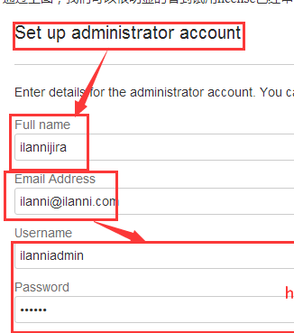
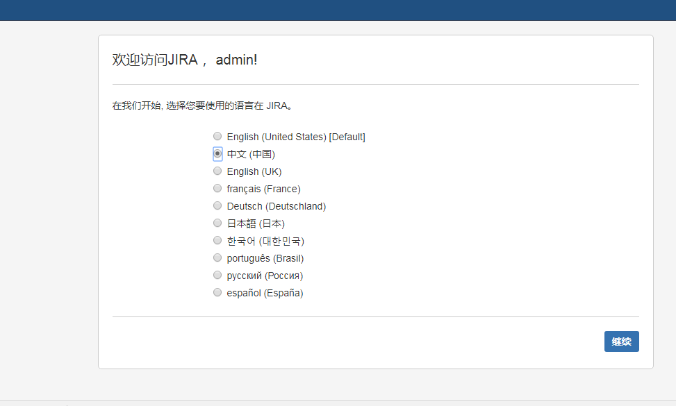

## JIRA简介

JIRA是Atlassian公司出品的项目与事务跟踪工具，被广泛应用于缺陷跟踪、客户服务、需求收集、流程审批、任务跟踪、项目跟踪和敏捷管理等工作领域。

JIRA是Atlassian公司的产品。Atlassian公司于2002在澳大利亚悉尼成立，提供面向企业业务流程的协同办公产品，并于2015年12月在纳斯达克上市。作为一家SaaS公司，不雇佣一个销售人员，仅通过口碑获客，市值达10亿美金级别（64亿美元-2017年3月13日），这也从另外角度反映出这个产品的独特之处。
 Atlassian主要有5款产品，分别面向不同的市场。

- JIRA（项目任务管理软件）
- Confluence（企业知识管理与协同软件）
- BitBucket（代码库）
- HipChat（内部聊天/协作软件）
- JIRA Service Desk（服务台软件）。

Atlassian最核心的产品仍然是**JIRA**和**Confluence**，JIRA被业界公认为最好的项目管理和开发管理工具，Confluence 被认为是最好用的企业级知识管理工具。
 包括美国航空航天局使用Atlassian来设计火星探测器，Runkeeper使用Atlassian来设计健身应用。eBay、宝马、花旗都是Atlassian客户。传闻世界 500 强企业里,80% 都用过JIRA。

<!-- more -->

## 安装与破解 

一、环境准备 
1、jira7.3的运行是依赖java环境的，也就是说需要安装jdk并且要是1.8以上版本 

见Linux安装JDK

```shell
[hzg@Idea-A-CentOS conf]$ java -version
java version "1.8.0_221"
Java(TM) SE Runtime Environment (build 1.8.0_221-b11)
Java HotSpot(TM) 64-Bit Server VM (build 25.221-b11, mixed mode)
[hzg@Idea-A-CentOS conf]$
```

2、安装MySQL服务器

见Linux安装MySQL

```shell
[hzg@Idea-A-CentOS conf]$ mysql -V
mysql  Ver 15.1 Distrib 5.5.60-MariaDB, for Linux (x86_64) using readline 5.1
[hzg@Idea-A-CentOS conf]$ 
```

3、我们还需要为jira创建对应的数据库、用户名和密码，如下：

```mysql
>create database jira default character set utf8 collate utf8_bin;

>grant all on *.* to ‘root'@'%’ identified by ‘jirapasswd’;

>flush privileges;
```

二、下载jira及其破解包 

1、下载jira并安装jira

```shell
[hzg@Idea-A-CentOS opt]$ sudo wget https://downloads.atlassian.com/software/jira/downloads/atlassian-jira-software-7.3.8-x64.bin
--2019-08-22 11:02:06--  https://downloads.atlassian.com/software/jira/downloads/atlassian-jira-software-7.3.8-x64.bin
正在解析主机 downloads.atlassian.com (downloads.atlassian.com)... 13.225.175.234, 2600:9000:21b7:800:1f:ab86:b4a:17e1, 2600:9000:21b7:6400:1f:ab86:b4a:17e1, ...
正在连接 downloads.atlassian.com (downloads.atlassian.com)|13.225.175.234|:443... 已连接。
已发出 HTTP 请求，正在等待回应... 200 OK
长度：325454759 (310M) [application/octet-stream]
正在保存至: “atlassian-jira-software-7.3.8-x64.bin”

100%[=========================================================================================================================================================>] 325,454,759 2.03MB/s 用时 3m 46s 

2019-08-22 11:05:53 (1.37 MB/s) - 已保存 “atlassian-jira-software-7.3.8-x64.bin” [325454759/325454759])

```

修改权限，并安装

```shell
[hzg@Idea-A-CentOS opt]$ sudo chmod 755 atlassian-jira-software-7.3.8-x64.bin 
[hzg@Idea-A-CentOS opt]$ sudo ./atlassian-jira-software-7.3.8-x64.bin 
Unpacking JRE ...
Starting Installer ...
八月 22, 2019 11:08:26 上午 java.util.prefs.FileSystemPreferences$2 run
信息: Created system preferences directory in java.home.

This will install JIRA Software 7.3.8 on your computer.
OK [o, Enter], Cancel [c]
o
Choose the appropriate installation or upgrade option.
Please choose one of the following:
Express Install (use default settings) [1], Custom Install (recommended for advanced users) [2, Enter], Upgrade an existing JIRA installation [3]
1
Details on where JIRA Software will be installed and the settings that will be used.
Installation Directory: /opt/atlassian/jira 
Home Directory: /var/atlassian/application-data/jira 
HTTP Port: 8080 
RMI Port: 8005 
Install as service: Yes 
Install [i, Enter], Exit [e]
i

Extracting files ...
                                                                           

Please wait a few moments while JIRA Software is configured.
Installation of JIRA Software 7.3.8 is complete
Start JIRA Software 7.3.8 now?
Yes [y, Enter], No [n]
y

Please wait a few moments while JIRA Software starts up.
Launching JIRA Software ...
Installation of JIRA Software 7.3.8 is complete
Your installation of JIRA Software 7.3.8 is now ready and can be accessed
via your browser.
JIRA Software 7.3.8 can be accessed at http://localhost:8080
Finishing installation ...
```

2、下载破解包 
破解包下载地址：链接：<https://pan.baidu.com/s/1ggtAR0v> 密码：p4gh 
破解包里面的atlassian-extras-3.2.jar和mysql-connector-java-5.1.39-bin.jar 
其中atlassian-extras-3.2.jar是用来替换原来的atlassian-extras-3.2.jar文件，用作破解jira系统的。 
而mysql-connector-java-5.1.39-bin.jar是用来连接mysql数据库的驱动软件包。

3、jira安装目录及配置文件 
从日志上可以看出jira安装到了/opt/atlassian/jira和/var/atlassian/application-data/jira目录下，并且jira监听的端口是8080，可以打开配置文件更改端口。

jira的主要配置文件，存放在/opt/atlassian/jira/conf/server.xml文件中，如下：

```
[root@localhost ~]#vim /opt/atlassian/jira/conf/server.xml
```


4、使用./stop-jira.sh关闭jira，然后把破解包里面的atlassian-extras-3.2.jar和mysql-connector-java-5.1.39-bin.jar两个文件复制到/opt/atlassian/jira/atlassian-jira/WEB-INF/lib/目录下，复制文件可以使用WinSCP软件来操作linux文件。 
使用./start-jira.sh启动jira，然后我们现在来访问如下地址：[http://192.168.1.178:8080](http://192.168.1.178:8080/)


## 删除jira 

查看jira安装的目录，直接删除/opt/atlassian/jira和/var/atlassian/application-data/jira目录 

## 启动成功：

访问以上地址后，系统会自动跳转到jira的默认配置页面，在此我们选择自定义配置，如下：


 

 

前提，创建一个数据库名为jira，在数据库方面，我们选择mysql数据库即可，填写完毕后相关的数据库地址、用户和密码后，就可以点击next按钮，如下：


 

数据库初始化完毕后，我们来查看下jira数据库的内容，如下：


 

而连接数据库的配置是/var/atlassian/application-data/jira/dbconfig.xml，如下：

cat /var/atlassian/application-data/jira/dbconfig.xml


 

下面的配置就比较简单了，自定义也可以，默认也可以。


 

注意：上图中的Mode中，我们在此使用的是Private模式，在这个模式下，用户的创建需要由管理员创建。而在Public模式下，用户是可以自己进行注册。

下面这个页面是需要我们输入jira的license，如下：


 

注意：上图中的Server ID：BRWS-OZIC-9BTE-YI9F

因为我们没有正式的license，所以需要我们在jira官网注册一个账号，然后利用这个账号申请一个可以试用30天的license，如下：


 

注意：这个图中的Server ID就是我们上面刚刚截图的Server ID。


 


 

 

通过上图，我们可以很明显的看到试用license已经申请成功。下面开始创建管理员账户，如下：


 



 


 



 


 

创建第一个项目，如下：


 


 


 


 

[](http://www.ilanni.com/wp-content/uploads/2016/09/clip_image028-1.png)

到此jira7.2.2软件的安装就已经基本快结束了，下面我们来介绍jira的破解和中文。

## 破解jira

破解jira，其实我们已经破解了在第3.1章节复制atlassian-extras-3.1.2.jar到/opt/atlassian/jira/atlassian-jira/WEB-INF/lib/目录下时，再次启动jira时就已经破解了。

我们现在登陆到jira中查看授权信息，如下：


 

通过上图，我们可以很明显的看到jira我们可以使用到2033年，而目前是2019年。到此有关jira的安装、中文与破解就已经全部结束。

 如何修改内存？

 

 日志查看：

```
tail -f ../logs/catalina.out
```


